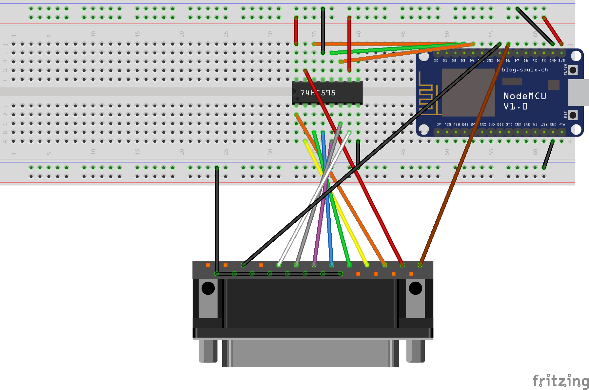

### Note: Library update required

If you are getting the following compile error:

```no matching function for call to 'CH375::setBaudRate(int, USBPortPrinter::ensureInitialized()::__lambda0)```

you need to update the [CH375-Arduino](https://github.com/gianluca-nitti/CH375-Arduino) library to the [`6a78463`](https://github.com/gianluca-nitti/CH375-Arduino/commit/6a7846306f029d99621b5b8d5f409cc859f955e2) commit.

# printserver-esp8266

* This project allows you to use an ESP8266 as a Wi-Fi print server.
* It works with the [IPP protocol](https://en.wikipedia.org/wiki/Internet_Printing_Protocol); the connected printers are accessible at `ipp://esp-ip-address:631/printer-name`, where the printer names can be configured in the `printserver/printserver.ino` file. By default, two printers are available, "parallel" which points to a real printer with the parallel port connected to the board's GPIOs and "serial" which prints the data to the serial UART (for debugging purposes).
* The "AppSocket" or "HP JetDirect" protocol is also supported (on the TCP port 9100), but only for the first printer.
* If a new connection arrives while a print job is being processed, the new job is stored in the SPIFFS filesystem (must fit in ~3MB, otherwise it's discarded due to lack of space) and printed as soon as the printer is ready. Unfortunately this feature has poor performance due to the very low speed of the SPIFFS filesystem.
* It's mainly aimed at parallel port printers, which can be connected in two different ways:
	* Directly (uses 10 GPIO pins - one for BUSY, one for STROBE and 8 for the data lines)
	* Using a shift register, which reduces the amount of required pins to 5 (BUSY, STROBE, and 3 to drive the shift register to which the data lines are connected; currently tested with a 74HC595)
* Also supports USB printers through the USB host chip CH375 and a custom [library](https://github.com/gianluca-nitti/CH375-Arduino)
* Experimental support for serial printers (not tested with real ones, only with the serial monitor)
* If the device fails to connect to the latest used WiFi network (for example the first time you flash the sketch), it will start an access point you can connect to. The web interface can then be used to select the network you want to connect the device to.

## Useful links
* Socket/JetDirect protocol: http://lprng.sourceforge.net/LPRng-Reference-Multipart/socketapi.htm
* IPP protocol: RFCs [8010](https://tools.ietf.org/html/rfc8010) and [8011](https://tools.ietf.org/html/rfc8011)
* Parallel port:
	* Wikipedia: https://en.wikipedia.org/wiki/Parallel_port
	* Full specification (IEEE 1284): http://ieeexplore.ieee.org/document/469123/
	* Arduino forum thread: https://forum.arduino.cc/index.php?topic=74776.0

## Wiring diagram for parallel port printer with 74HC595 shift register



As kindly reported in [issue #18](https://github.com/gianluca-nitti/printserver-esp8266/issues/18) (read the linked discussion for more details), a couple of improvements can be made to this schematic. In particular, the BUSY signal from the printer can be converted fom 5V to 3.3V, for example by making a simple voltage divider with a couple of resistors of appropriate value, to further protect the ESP8266 input pin. It's not 100% clear whether it's 5V tolerant.

## Photo with HP DeskJet 840C


## Class diagram


